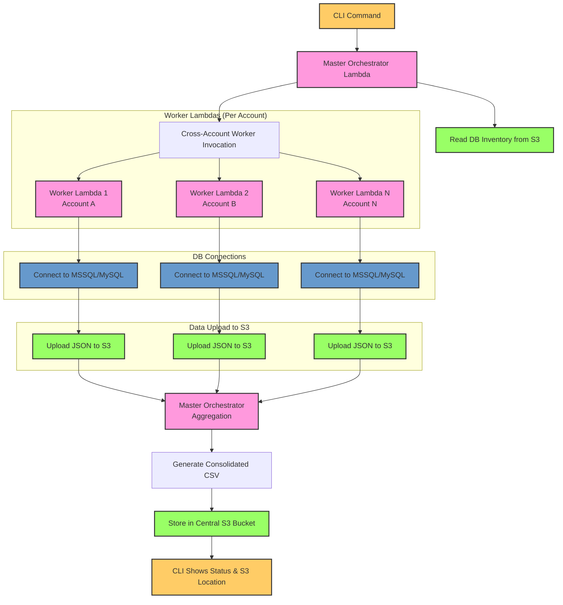

# DB Admin Reports CLI Tool - Project Guidelines

## 📑 Table of Contents

### [🎯 Project Overview](#-project-overview)
- [Primary Goal](#primary-goal)
- [Business Value](#business-value)
- [Reference](#reference)

### [🏗️ System Architecture](#️-system-architecture)
- [High-Level Architecture](#high-level-architecture)
- [Architecture Diagram](#architecture-diagram)
- [Component Overview](#component-overview)

### [📋 Complete Workflow](#-complete-workflow)
- [Step 1: CLI Execution](#step-1-cli-execution)
- [Step 2: Master Orchestrator Processing](#step-2-master-orchestrator-processing)
- [Step 3: Cross-Account Worker Invocation](#step-3-cross-account-worker-invocation)
- [Step 4: Worker Lambda Data Collection](#step-4-worker-lambda-data-collection)
- [Step 5: Report Generation and Storage](#step-5-report-generation-and-storage)

### [🛠️ Technical Requirements](#️-technical-requirements)
- [1. CLI Tool Requirements](#1-cli-tool-requirements)
- [2. Master Orchestrator Lambda Requirements](#2-master-orchestrator-lambda-requirements)
- [3. Worker Lambda Requirements](#3-worker-lambda-requirements)
- [4. CSV Report Format Requirements](#4-csv-report-format-requirements)
- [5. Infrastructure Requirements (Pulumi)](#5-infrastructure-requirements-pulumi)

### [🔧 Development Guidelines](#-development-guidelines)
- [Code Quality Standards](#code-quality-standards)
- [Error Handling Patterns](#error-handling-patterns)
- [Logging Standards](#logging-standards)
- [Configuration Management](#configuration-management)

### [🚀 Deployment Strategy](#-deployment-strategy)
- [Phase 1: Infrastructure Deployment](#phase-1-infrastructure-deployment)
- [Phase 2: Lambda Deployment](#phase-2-lambda-deployment)
- [Phase 3: CLI Tool Development](#phase-3-cli-tool-development)
- [Phase 4: Testing and Validation](#phase-4-testing-and-validation)

### [📊 Monitoring and Observability](#-monitoring-and-observability)
- [CloudWatch Metrics](#cloudwatch-metrics)
- [CloudWatch Logs](#cloudwatch-logs)
- [Alerts and Notifications](#alerts-and-notifications)

### [🔒 Security Considerations](#-security-considerations)
- [Data Protection](#data-protection)
- [Compliance Requirements](#compliance-requirements)
- [Security Testing](#security-testing)

### [📈 Performance Optimization](#-performance-optimization)
- [Lambda Optimization](#lambda-optimization)
- [Database Optimization](#database-optimization)
- [Network Optimization](#network-optimization)

### [🧪 Testing Strategy](#-testing-strategy)
- [Unit Testing](#unit-testing)
- [Integration Testing](#integration-testing)
- [Load Testing](#load-testing)

### [📚 Documentation Requirements](#-documentation-requirements)
- [Technical Documentation](#technical-documentation)
- [User Documentation](#user-documentation)
- [Compliance Documentation](#compliance-documentation)

### [🎯 Success Metrics](#-success-metrics)
- [Performance Metrics](#performance-metrics)
- [Business Metrics](#business-metrics)
- [Operational Metrics](#operational-metrics)

### [🔄 Maintenance and Operations](#-maintenance-and-operations)
- [Regular Maintenance](#regular-maintenance)
- [Operational Procedures](#operational-procedures)
- [Continuous Improvement](#continuous-improvement)

---

## 🎯 Project Overview

### Primary Goal
Generate on-demand database administrator access reports via a CLI tool that triggers cross-account data collection and CSV report generation for SOC2 audit compliance.

### Business Value
- **Automation**: Eliminates manual screenshot collection for SOC2 audits
- **Compliance**: Provides system-generated, timestamped, auditable reports
- **Efficiency**: Reduces hours of manual effort per audit cycle
- **Reliability**: Ensures consistent, complete coverage across all database infrastructure

### Reference
- **GRC Control**: [StrikeGraph Control Detail](https://grc.strikegraph.com/organization/085c5b9b-eee0-49d0-9b07-296e3787734d/control/control_detail/176245)

---

## 🏗️ System Architecture

### High-Level Architecture
```
┌─────────────────┐    ┌──────────────────────┐    ┌─────────────────┐
│   CLI Tool      │───▶│ Master Orchestrator  │───▶│ Worker Lambdas  │
│   (Entry Point) │    │ Lambda              │    │ (Per Account)   │
└─────────────────┘    └──────────────────────┘    └─────────────────┘
                                │                           │
                                ▼                           ▼
                       ┌─────────────────┐    ┌──────────────────────┐
                       │ Central S3      │    │ Database Connections │
                       │ Bucket          │    │ (MSSQL/MySQL)       │
                       └─────────────────┘    └──────────────────────┘
```
### Architecture Diagram

### Component Overview
1. **CLI Tool**: User interface for triggering reports
2. **Master Orchestrator**: Coordinates cross-account execution
3. **Worker Lambdas**: Individual account data collectors
4. **Infrastructure**: Pulumi-managed AWS resources
5. **Reports**: CSV format for compliance verification

---

## 📋 Complete Workflow

### Step 1: CLI Execution
- Operations team runs CLI command to request database admin report
- CLI authenticates with AWS using configured credentials
- CLI invokes master orchestrator Lambda with request parameters

### Step 2: Master Orchestrator Processing
- **Account**: bb-us-product (209371858707)
- Reads database inventory list from S3 or Parameter Store
- Parses configuration for target AWS accounts and regions
- Prepares cross-account IAM role assumptions

### Step 3: Cross-Account Worker Invocation
- For each target account and region:
  - Assumes IAM role using STS for cross-account access
  - Invokes worker Lambda asynchronously with 10-minute timeout
  - Implements exponential backoff retry logic (max 3 retries)
  - Handles partial failures gracefully

### Step 4: Worker Lambda Data Collection
- Worker Lambdas connect to target databases (MSSQL and MySQL)
- Execute predefined SQL queries to collect admin user data
- Upload results to central S3 bucket using cross-account IAM roles
- Return execution status and S3 location to orchestrator

### Step 5: Report Generation and Storage
- Orchestrator aggregates all worker responses
- Generates consolidated CSV report with timestamps and metadata
- Stores final report in central S3 bucket with organized naming
- CLI displays report generation status and S3 location

---

## 🛠️ Technical Requirements

### 1. CLI Tool Requirements

#### Technology Stack
- **Language**: TypeScript/JavaScript (Node.js)
- **Framework**: Commander.js or similar CLI framework
- **Authentication**: AWS SDK for JavaScript v3
- **Configuration**: Environment variables or config files

#### Features
- **Command Structure**: `db-admin-report generate [options]`
- **Options**: 
  - `--accounts`: Comma-separated list of target accounts
  - `--regions`: Comma-separated list of target regions
  - `--output-format`: csv (default)
  - `--verbose`: Enable detailed logging
- **Authentication**: AWS credentials (profile, environment, or IAM role)
- **Output**: Report generation status and S3 download location

#### Error Handling
- Validate AWS credentials before execution
- Handle network timeouts gracefully
- Provide clear error messages for common issues
- Support for retry logic on transient failures

### 2. Master Orchestrator Lambda Requirements

#### Technology Stack
- **Language**: TypeScript
- **Runtime**: Node.js 18.x
- **AWS SDK**: AWS SDK for JavaScript v3
- **Dependencies**: 
  - `@aws-sdk/client-lambda`
  - `@aws-sdk/client-s3`
  - `@aws-sdk/client-sts`
  - `@aws-sdk/client-ssm`

#### Core Functions
```typescript
interface OrchestratorConfig {
  targetAccounts: string[];
  targetRegions: string[];
  workerLambdaName: string;
  s3BucketName: string;
  timeoutMinutes: number;
  maxRetries: number;
}

interface WorkerResponse {
  accountId: string;
  region: string;
  status: 'success' | 'failure';
  s3Location?: string;
  errorMessage?: string;
  dataCount?: number;
}
```

#### Key Features
- **Configuration Management**: Read from S3 or Parameter Store
- **Cross-Account Execution**: STS role assumption for each account
- **Timeout Management**: 10-minute timeout per worker invocation
- **Retry Logic**: Exponential backoff with 3-retry maximum
- **Result Aggregation**: Collect and validate all worker responses
- **CSV Generation**: Create consolidated reports with metadata
- **Error Handling**: Graceful partial failure handling

#### Performance Requirements
- Handle 10+ databases across multiple accounts efficiently
- Complete execution within 15 minutes for typical environments
- Memory usage optimized for large dataset processing

### 3. Worker Lambda Requirements

#### Technology Stack
- **Language**: TypeScript
- **Runtime**: Node.js 18.x
- **Database Drivers**: 
  - `mssql` for SQL Server connections
  - `mysql2` for MySQL connections
- **AWS SDK**: AWS SDK for JavaScript v3
- **Dependencies**:
  - `@aws-sdk/client-secrets-manager`
  - `@aws-sdk/client-s3`
  - `mssql`, `mysql2`

#### Database Support
- **SQL Server**: RDS and EC2-hosted instances
- **MySQL**: RDS and EC2-hosted instances
- **Connection Pooling**: Efficient handling of multiple databases
- **Credential Management**: AWS Secrets Manager integration

#### Data Collection Queries

**SQL Server Admin Users Query:**
```sql
SELECT 
    dp.name AS username,
    dp.type_desc AS user_type,
    CASE 
        WHEN dp.name IN (SELECT name FROM sys.server_principals WHERE type = 'S') THEN 'System Admin'
        WHEN dp.name IN (SELECT name FROM sys.server_principals WHERE type = 'U') THEN 'User'
        ELSE 'Other'
    END AS role_name,
    'Admin' AS permission_level,
    COALESCE(CAST(LOGINPROPERTY(dp.name, 'LastLoginTime') AS VARCHAR), 'Never') AS last_login_date,
    @@SERVERNAME AS account_details
FROM sys.server_principals dp
WHERE dp.type IN ('S', 'U')
    AND dp.name NOT LIKE '##%'
    AND dp.name NOT IN ('sa', 'public', 'guest')
ORDER BY dp.name;
```

**MySQL Admin Users Query:**
```sql
SELECT 
    u.User AS username,
    u.Host AS host,
    CASE 
        WHEN u.User = 'root' THEN 'Root Admin'
        WHEN u.Select_priv = 'Y' AND u.Insert_priv = 'Y' AND u.Update_priv = 'Y' AND u.Delete_priv = 'Y' THEN 'Full Admin'
        ELSE 'Limited User'
    END AS role_name,
    CASE 
        WHEN u.User = 'root' OR (u.Select_priv = 'Y' AND u.Insert_priv = 'Y' AND u.Update_priv = 'Y' AND u.Delete_priv = 'Y') THEN 'Admin'
        ELSE 'User'
    END AS permission_level,
    COALESCE(u.authentication_string, 'N/A') AS last_login_date,
    @@hostname AS account_details
FROM mysql.user u
WHERE u.User NOT IN ('', 'debian-sys-maint', 'mysql.session', 'mysql.sys')
ORDER BY u.User, u.Host;
```

#### Security Features
- **SQL Injection Protection**: Parameterized queries only
- **Input Validation**: Validate all database connection parameters
- **Credential Security**: Read-only credentials from Secrets Manager
- **Connection Cleanup**: Proper resource management and cleanup

#### Output Format
```typescript
interface DatabaseAdminUser {
  username: string;
  role_name: string;
  permission_level: string;
  last_login_date: string;
  account_details: string;
  database_name: string;
  database_type: 'MSSQL' | 'MySQL';
  collection_timestamp: string;
}

interface WorkerOutput {
  accountId: string;
  region: string;
  databaseConnections: DatabaseConnection[];
  adminUsers: DatabaseAdminUser[];
  errors: DatabaseError[];
  metadata: {
    totalUsers: number;
    totalDatabases: number;
    collectionStartTime: string;
    collectionEndTime: string;
  };
}
```

### 4. CSV Report Format Requirements

#### File Structure
- **Format**: Standard CSV compatible with Excel
- **Encoding**: UTF-8 with BOM for Excel compatibility
- **Headers**: Include column headers for clarity

#### Required Columns
1. **Account ID**: AWS account identifier
2. **Region**: AWS region (e.g., us-east-1)
3. **Database Name**: Name of the database instance
4. **Database Type**: MSSQL or MySQL
5. **Username**: Database user account name
6. **Role Name**: User role or privilege level
7. **Permission Level**: Admin, User, or specific permissions
8. **Last Login Date**: Most recent login timestamp
9. **User Status**: Active, Disabled, or other status
10. **Report Timestamp**: When the data was collected

#### Organization
- **Grouping**: Organize by AWS Account with clear section headers
- **Sorting**: Sort by Account ID, then by Database Name, then by Username
- **Error Sections**: Include failed connections with explicit error reasons

#### Example CSV Structure
```csv
Account ID,Region,Database Name,Database Type,Username,Role Name,Permission Level,Last Login Date,User Status,Report Timestamp
123456789012,us-east-1,prod-mssql-01,MSSQL,admin,System Admin,Admin,2024-01-15T10:30:00Z,Active,2024-01-15T14:22:33Z
123456789012,us-east-1,prod-mssql-01,MSSQL,dbuser,User,User,2024-01-14T09:15:00Z,Active,2024-01-15T14:22:33Z
ERROR: 123456789012,us-east-1,prod-mysql-02,MySQL,Connection Failed: Authentication failed,2024-01-15T14:22:33Z
```

### 5. Infrastructure Requirements (Pulumi)

#### Project Structure
```
infrastructure/
├── src/
│   ├── index.ts              # Main Pulumi program
│   ├── components/
│   │   ├── cloudwatch.ts     # CloudWatch Log Groups
│   │   ├── iam.ts           # IAM Roles and Policies
│   │   ├── networking.ts    # VPC Endpoints
│   │   └── security.ts      # KMS Keys
│   └── utils/
│       ├── config.ts        # Configuration utilities
│       └── tags.ts          # Tag management
├── Pulumi.yaml
├── package.json
└── tsconfig.json
```

#### CloudWatch Log Groups
- **Naming Convention**: `/aws/security-ops/{account}/{region}/{service}/{component}`
- **Retention Policies**:
  - Security/Audit logs: 90 days
  - Operational logs: 7 days
- **Encryption**: KMS encryption at rest

#### IAM Roles and Policies
- **Cross-Account Roles**: Least-privilege permissions for log shipping
- **Worker Lambda Roles**: Database access and S3 upload permissions
- **Orchestrator Roles**: Cross-account Lambda invocation permissions
- **Explicit Deny Policies**: Prevent log deletion on security-critical groups

#### Security Components
- **KMS Keys**: Encryption for logs in transit and at rest
- **VPC Endpoints**: CloudWatch Logs endpoints to avoid egress charges
- **Parameter Store**: Centralized configuration management
- **Cost Allocation Tags**: Uniform tagging across all resources

---

## 🔧 Development Guidelines

### Code Quality Standards
- **TypeScript**: Strict type checking enabled
- **ESLint**: Consistent code style and best practices
- **Prettier**: Consistent code formatting
- **Unit Tests**: Minimum 80% code coverage
- **Integration Tests**: End-to-end workflow testing

### Error Handling Patterns
```typescript
// Consistent error handling pattern
try {
  const result = await operation();
  logger.info('Operation completed successfully', { result });
  return result;
} catch (error) {
  logger.error('Operation failed', { 
    error: error.message, 
    stack: error.stack,
    context: { operation: 'operationName' }
  });
  throw new CustomError('Operation failed', { cause: error });
}
```

### Logging Standards
```typescript
// Structured logging with correlation IDs
const logger = {
  info: (message: string, metadata?: Record<string, any>) => {
    console.log(JSON.stringify({
      level: 'INFO',
      message,
      timestamp: new Date().toISOString(),
      correlationId: getCorrelationId(),
      ...metadata
    }));
  },
  error: (message: string, metadata?: Record<string, any>) => {
    console.error(JSON.stringify({
      level: 'ERROR',
      message,
      timestamp: new Date().toISOString(),
      correlationId: getCorrelationId(),
      ...metadata
    }));
  }
};
```

### Configuration Management
```typescript
interface AppConfig {
  // AWS Configuration
  aws: {
    region: string;
    accounts: string[];
    regions: string[];
  };
  
  // Lambda Configuration
  lambda: {
    orchestratorName: string;
    workerName: string;
    timeoutMinutes: number;
    maxRetries: number;
  };
  
  // Database Configuration
  database: {
    connectionTimeout: number;
    queryTimeout: number;
    maxConnections: number;
  };
  
  // S3 Configuration
  s3: {
    bucketName: string;
    reportPrefix: string;
  };
}
```

---

## 🚀 Deployment Strategy

### Phase 1: Infrastructure Deployment
1. **Deploy Pulumi Infrastructure** across all 8 accounts and 2 regions
2. **Verify IAM Roles** and cross-account permissions
3. **Test CloudWatch Log Groups** and retention policies
4. **Validate KMS Keys** and encryption settings

### Phase 2: Lambda Deployment
1. **Deploy Worker Lambdas** to all target accounts
2. **Configure Secrets Manager** with database credentials
3. **Deploy Master Orchestrator** to central account
4. **Test Cross-Account Invocation** with sample data

### Phase 3: CLI Tool Development
1. **Develop CLI Interface** with proper error handling
2. **Implement Authentication** and AWS credential management
3. **Add Configuration Management** for different environments
4. **Create Documentation** and usage examples

### Phase 4: Testing and Validation
1. **Unit Tests** for all components
2. **Integration Tests** for complete workflow
3. **Performance Testing** with realistic data volumes
4. **Security Testing** and penetration testing

---

## 📊 Monitoring and Observability

### CloudWatch Metrics
- **Lambda Invocations**: Success/failure rates
- **Execution Duration**: Performance monitoring
- **Error Rates**: Database connection failures
- **Data Volume**: Number of admin users collected

### CloudWatch Logs
- **Structured Logging**: JSON format for easy parsing
- **Correlation IDs**: Track requests across components
- **Log Levels**: INFO, WARN, ERROR with appropriate filtering
- **Retention**: 90 days for security logs, 7 days for operational

### Alerts and Notifications
- **High Error Rates**: Alert on worker Lambda failures
- **Timeout Alerts**: Notify on long-running executions
- **Data Quality**: Alert on unexpected data volumes
- **Security Events**: Monitor for unauthorized access attempts

---

## 🔒 Security Considerations

### Data Protection
- **Encryption at Rest**: All data encrypted in S3 and databases
- **Encryption in Transit**: TLS 1.2+ for all connections
- **Credential Management**: AWS Secrets Manager for database credentials
- **Access Control**: Least-privilege IAM policies

### Compliance Requirements
- **SOC2 Compliance**: Audit trail for all operations
- **Data Retention**: Configurable retention policies
- **Access Logging**: All access attempts logged
- **Data Classification**: No sensitive business data in reports

### Security Testing
- **Penetration Testing**: Regular security assessments
- **Vulnerability Scanning**: Automated security scanning
- **Code Review**: Security-focused code reviews
- **Dependency Scanning**: Regular dependency updates

---

## 📈 Performance Optimization

### Lambda Optimization
- **Memory Allocation**: Optimize for CPU-intensive operations
- **Cold Start Reduction**: Provisioned concurrency for critical functions
- **Dependency Optimization**: Minimize package size
- **Connection Pooling**: Efficient database connection management

### Database Optimization
- **Query Optimization**: Efficient SQL queries with proper indexing
- **Connection Management**: Pool connections for multiple databases
- **Timeout Configuration**: Appropriate timeouts for different database types
- **Batch Processing**: Process multiple databases concurrently

### Network Optimization
- **VPC Endpoints**: Reduce egress charges and improve performance
- **Cross-Region Optimization**: Minimize cross-region data transfer
- **CDN Integration**: Fast report download for users
- **Compression**: Compress large reports for faster transfer

---

## 🧪 Testing Strategy

### Unit Testing
- **Component Testing**: Test each Lambda function independently
- **Mock Dependencies**: Mock AWS services and database connections
- **Error Scenarios**: Test all error conditions and edge cases
- **Performance Testing**: Test with realistic data volumes

### Integration Testing
- **End-to-End Testing**: Complete workflow testing
- **Cross-Account Testing**: Test cross-account Lambda invocation
- **Database Testing**: Test with real database connections
- **Report Generation**: Validate CSV report format and content

### Load Testing
- **Concurrent Execution**: Test multiple simultaneous report requests
- **Large Dataset Testing**: Test with 100+ databases
- **Timeout Testing**: Verify timeout handling under load
- **Memory Testing**: Monitor memory usage under stress

---

## 📚 Documentation Requirements

### Technical Documentation
- **Architecture Diagrams**: System and component diagrams
- **API Documentation**: Lambda function interfaces
- **Database Schemas**: Query structures and data formats
- **Configuration Guide**: Environment setup and configuration

### User Documentation
- **CLI Usage Guide**: Command reference and examples
- **Troubleshooting Guide**: Common issues and solutions
- **Deployment Guide**: Step-by-step deployment instructions
- **Maintenance Guide**: Operational procedures and maintenance tasks

### Compliance Documentation
- **Audit Trail**: Complete audit trail documentation
- **Security Controls**: Security control implementation details
- **Data Flow Diagrams**: Data movement and processing documentation
- **Risk Assessment**: Security and compliance risk documentation

---

## 🎯 Success Metrics

### Performance Metrics
- **Execution Time**: Reports generated within 15 minutes
- **Success Rate**: 95%+ successful report generation
- **Error Rate**: <5% database connection failures
- **Resource Usage**: Efficient CPU and memory utilization

### Business Metrics
- **Time Savings**: 80% reduction in manual audit effort
- **Compliance Coverage**: 100% database infrastructure coverage
- **Report Quality**: 100% accurate admin user data
- **User Satisfaction**: Positive feedback from compliance teams

### Operational Metrics
- **Deployment Success**: 100% successful infrastructure deployment
- **Monitoring Coverage**: 100% component monitoring
- **Security Incidents**: Zero security incidents
- **Availability**: 99.9% system availability

---

## 🔄 Maintenance and Operations

### Regular Maintenance
- **Dependency Updates**: Monthly security updates
- **Performance Monitoring**: Weekly performance reviews
- **Security Audits**: Quarterly security assessments
- **Compliance Reviews**: Annual compliance verification

### Operational Procedures
- **Incident Response**: Documented incident response procedures
- **Backup and Recovery**: Regular backup and recovery testing
- **Change Management**: Controlled change deployment process
- **Monitoring and Alerting**: 24/7 monitoring and alerting

### Continuous Improvement
- **Feedback Collection**: Regular user feedback collection
- **Performance Optimization**: Ongoing performance improvements
- **Feature Enhancements**: Regular feature additions
- **Security Hardening**: Continuous security improvements
